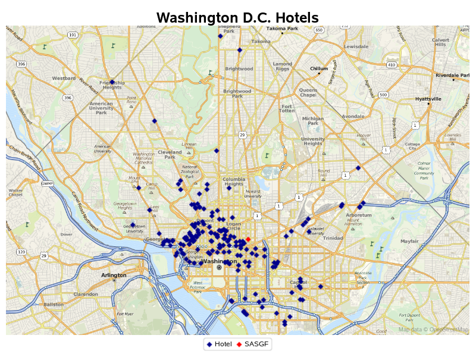
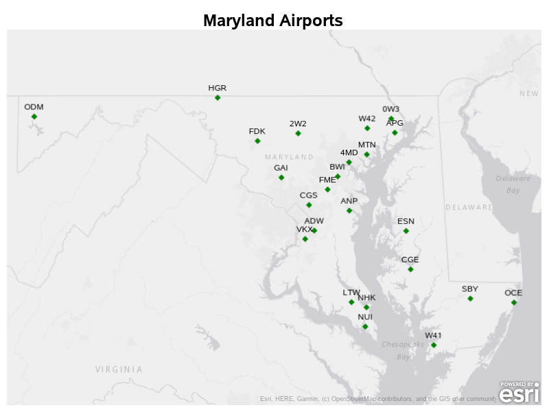
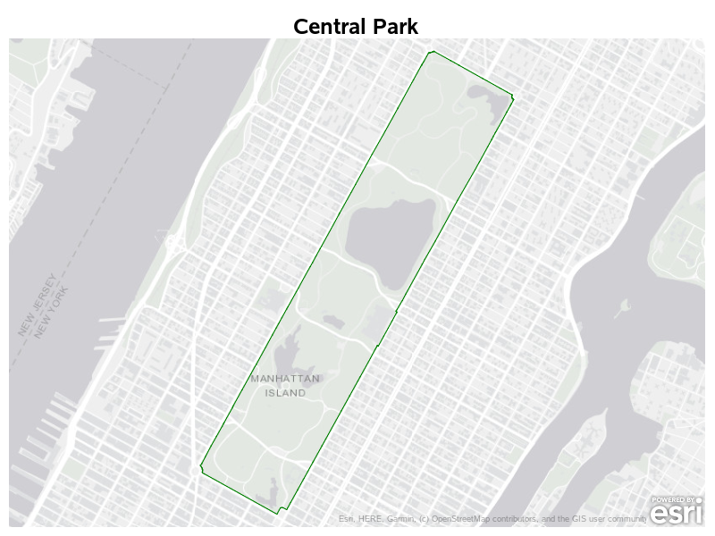

# hot-sas

> Analysis of [OpenStreetMap](https://www.openstreetmap.org) and the [Humanitarian OpenStreetMap Team](https://www.hotosm.org) data using [SAS Software](https://www.sas.com).

## Overview

The [Humanitarian OpenStreetMap Team](https://www.hotosm.org) (HOT) community consists of volunteers from around the globe.  HOT tasks involve developing maps that identify communities and infrastructures based on satellite imagery.  These maps are then used to assist aid organizations such as the Red Cross during humanitarian crises and for general community development in areas that are often not covered by the mapping products that most of us take for granted.

This repository examines [OpenStreetMap](https://www.openstreetmap.org) data and introduces HOT and some of the associated mapping tasks, including assisting the aid efforts during the May 2018 Ebola outbreak in the Democratic Republic of the Congo.

Analysis is performed on the data using the SAS® ODS Graphics procedures (including `PROC SGMAP`) to visualize the contributions to OpenStreetMap both spatially and over time.

## 1. OpenStreetMap data using the OverPass API

The first set of programs provide examples of extracting the OpenStreetMap data using the [Overpass API](https://wiki.openstreetmap.org/wiki/Overpass_API).

### 1.1 Hotels in Dallas

The first program [01_dallas_hotels.sas](sas/01_dallas_hotels.sas) provides an example of extracting the OpenStreetMap data for all of the Hotels in Dallas using the [Overpass API](https://wiki.openstreetmap.org/wiki/Overpass_API) which was the site of the **SAS Global Forum 2019**.

The `PROC SGMAP` output includes using OpenStreetMap tiles for the background, and the markers are based on buildings tagged in the OpenStreetMap data:

### 1.2 Hotels in Washington D.C.

The second program [01_washington_hotels.sas](sas/01_washington_hotels.sas) is similar, however this time is based in Washington D.C the site of the **SAS Global Forum 2020**:

### 1.3 Airports in Maryland with IATA Codes

The next program [01_maryland_airports.sas](sas/01_maryland_airports.sas) extracts the OpenStreetMap data for all of the Airports in Maryland with IATA codes, including labelling the markers:

### 1.4 Outline of Central Park

The program [01_central_park.sas](sas/01_central_park.sas) extracts the OpenStreetMap *Way* surrounding Central Park in New York and uses the `PROC SGMAP` statement `SERIES` to draw the boundary:

## 2. OpenStreetMap Changesets

The program [02_user_changesets.sas](sas/02_user_changesets.sas) introduces the OpenStreetMap XML format and how to read this with SAS Software.

The `PROC SGMAP` output shows the last 100 edits for a contributor to OpenStreetMap using the ESRI World Topographical background tiles:

## 3. Humanitarian OpenStreetMap Team Global Tasks

The program [03_hotosm_tasks.sas](sas/03_hotosm_tasks.sas) shows the location of the many tasks completed by contributors to the Humanitarian OpenStreetMap Team.

The first display shows the location of the global tasks using `PROC SGMAP` with ESRI World Topographical background tiles:

The second display shows how PROC SGMAP with a simple WHERE clause on the input data will adjust the boundaries of the generated map to show tasks in Africa:

## 4. Humanitarian OpenStreetMap Team Global Tasks

The final program [04_hotosm_drc.sas](sas/04_hotosm_drc.sas) details the extraction of OpenStreetMap data from [Geofabrik](https://download.geofabrik.de) for the [Democratic Republic of the Congo](https://en.wikipedia.org/wiki/Democratic_Republic_of_the_Congo).  This data is then used to perform analyses on the number of edits to OpenStreetMap during 2018 to support the Ebola crises.

The first output shows a scatter plot of the node edits during May 2018:

The second output shows this same data represented using hexagonal binning which can help to visualise the node density which may be lost in the previous display:

Due to the presence of hot spots outside of the north west where the Ebola crisis was present, an overlapping chart is produced to review the location of population centres which will be the subject of frequent changes due to normal OpenStreetMap updates:

The final result is a sequence of images, which are then processed with [ImageMagick®](https://www.imagemagick.org/) to create an animation with smooth transitions between frames:

The Animation output is available on [YouTube](https://youtu.be/brvmSHEmhWU).

An alternative to the hexagonal binning is to review the data at the node level using scatter plot techniques.  This can give an alternative view of the data, although obviously hides the density of edits.

In this example the individual frames also include a fade effect, with the current weeks data bright yellow, and subsequent weeks each in a darker colour:

The final result is a sequence of images, which are then processed again with ImageMagick to create an animation with smooth transitions between frames:

The Animation output is available on [YouTube](https://youtu.be/bNx4RK6TPrA).
